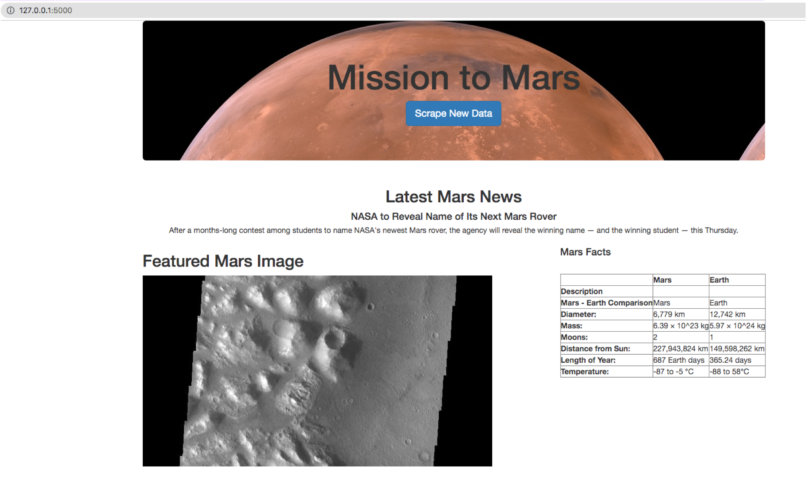

# Mission-to-Mars

## Project Overview 

The objective of the project is to put together a web-scraping project in order to get the latest news and updates and then create a web application about Mission to Mars. The following tools were used to complete the project: Chrome Developer Tools to identify HTML components, BeautifulSoup and Splinter to automate the scrape, Mongo to store the data, Flask to display data

---
## Images

---
